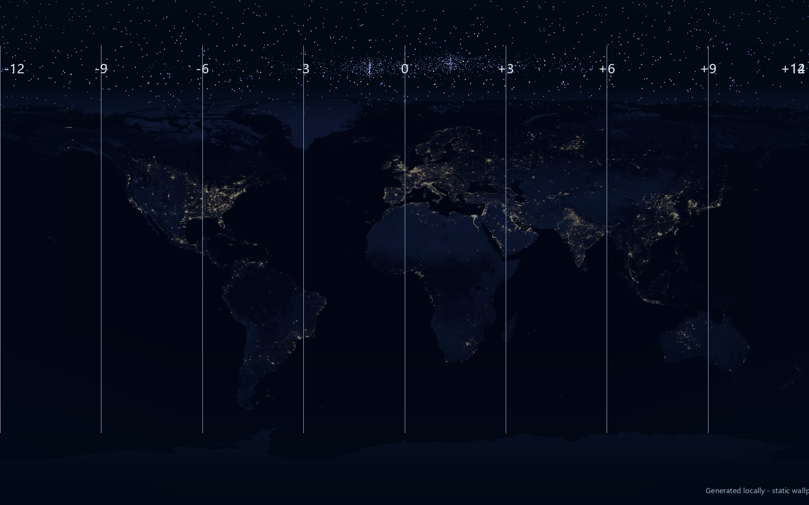

# World Time Wallpaper



## 简体中文

一款夜间世界地图风格的桌面壁纸项目，搭配 Rainmeter 实现底部世界时钟实时更新。画面包含星空、夜间地球城市灯光、UTC 时区参考线，以及檀香山、洛杉矶、纽约、伦敦、巴黎、迪拜、新德里、北京、东京、雪梨等城市时间。

### 内容

- `assets/cover.png`：干净封面图，适合搭配 Rainmeter 叠加层使用。
- `assets/static-preview.png`：带静态时间栏的预览图。
- `rainmeter/WorldTimeOverlay/WorldTimeOverlay.ini`：Rainmeter 世界时钟皮肤。
- `scripts/generate_timezone_wallpaper.py`：生成壁纸图片的 Python 脚本。

### 使用方式

1. 安装 [Rainmeter](https://www.rainmeter.net/)。
2. 将 `rainmeter/WorldTimeOverlay` 复制到 `Documents/Rainmeter/Skins/`。
3. 在 Rainmeter 中刷新皮肤列表并加载 `WorldTimeOverlay.ini`。
4. 将 `assets/cover.png` 设置为桌面壁纸。

### 重新生成图片

```powershell
pip install pillow
python scripts/generate_timezone_wallpaper.py
```

脚本会从 Wikimedia Commons 的 NASA 夜间地球图入口下载素材，并输出壁纸 PNG。

## 繁體中文

一款夜間世界地圖風格的桌面壁紙專案，搭配 Rainmeter 實現底部世界時鐘即時更新。畫面包含星空、夜間地球城市燈光、UTC 時區參考線，以及檀香山、洛杉磯、紐約、倫敦、巴黎、杜拜、新德里、北京、東京、雪梨等城市時間。

### 內容

- `assets/cover.png`：乾淨封面圖，適合搭配 Rainmeter 疊加層使用。
- `assets/static-preview.png`：帶靜態時間欄的預覽圖。
- `rainmeter/WorldTimeOverlay/WorldTimeOverlay.ini`：Rainmeter 世界時鐘皮膚。
- `scripts/generate_timezone_wallpaper.py`：生成壁紙圖片的 Python 腳本。

### 使用方式

1. 安裝 [Rainmeter](https://www.rainmeter.net/)。
2. 將 `rainmeter/WorldTimeOverlay` 複製到 `Documents/Rainmeter/Skins/`。
3. 在 Rainmeter 中重新整理皮膚列表並載入 `WorldTimeOverlay.ini`。
4. 將 `assets/cover.png` 設為桌面壁紙。

### 重新生成圖片

```powershell
pip install pillow
python scripts/generate_timezone_wallpaper.py
```

腳本會從 Wikimedia Commons 的 NASA 夜間地球圖入口下載素材，並輸出壁紙 PNG。

## English

A night-world-map desktop wallpaper project with a Rainmeter overlay for live world clocks. The design combines a star field, Earth city lights, UTC timezone guide lines, and city clocks for Honolulu, Los Angeles, New York, London, Paris, Dubai, New Delhi, Beijing, Tokyo, and Sydney.

### Contents

- `assets/cover.png`: Clean cover image for use with the Rainmeter overlay.
- `assets/static-preview.png`: Preview image with a static clock row.
- `rainmeter/WorldTimeOverlay/WorldTimeOverlay.ini`: Rainmeter world clock skin.
- `scripts/generate_timezone_wallpaper.py`: Python script for generating the wallpaper images.

### Usage

1. Install [Rainmeter](https://www.rainmeter.net/).
2. Copy `rainmeter/WorldTimeOverlay` to `Documents/Rainmeter/Skins/`.
3. Refresh Rainmeter and load `WorldTimeOverlay.ini`.
4. Set `assets/cover.png` as the desktop wallpaper.

### Regenerate Images

```powershell
pip install pillow
python scripts/generate_timezone_wallpaper.py
```

The script downloads the NASA night Earth source via Wikimedia Commons and exports PNG wallpapers.

## Français

Un projet de fond d'écran de bureau inspiré d'une carte du monde nocturne, accompagné d'une superposition Rainmeter pour afficher des horloges mondiales en temps réel. Le visuel combine un ciel étoilé, les lumières nocturnes de la Terre, des repères de fuseaux UTC et les heures de plusieurs villes : Honolulu, Los Angeles, New York, Londres, Paris, Dubaï, New Delhi, Pékin, Tokyo et Sydney.

### Contenu

- `assets/cover.png` : image de couverture propre, prévue pour être utilisée avec la superposition Rainmeter.
- `assets/static-preview.png` : aperçu avec une rangée d'horloges statiques.
- `rainmeter/WorldTimeOverlay/WorldTimeOverlay.ini` : skin Rainmeter pour les horloges mondiales.
- `scripts/generate_timezone_wallpaper.py` : script Python pour générer les images du fond d'écran.

### Utilisation

1. Installez [Rainmeter](https://www.rainmeter.net/).
2. Copiez `rainmeter/WorldTimeOverlay` dans `Documents/Rainmeter/Skins/`.
3. Actualisez Rainmeter et chargez `WorldTimeOverlay.ini`.
4. Définissez `assets/cover.png` comme fond d'écran du bureau.

### Régénérer les images

```powershell
pip install pillow
python scripts/generate_timezone_wallpaper.py
```

Le script télécharge l'image nocturne de la Terre de la NASA via Wikimedia Commons et exporte les fonds d'écran au format PNG.

## Credits

Earth city lights source: NASA / Wikimedia Commons, accessed through [City Lights 2012 - Flat map](https://commons.wikimedia.org/wiki/Special:FilePath/City_Lights_2012_-_Flat_map.jpg).

